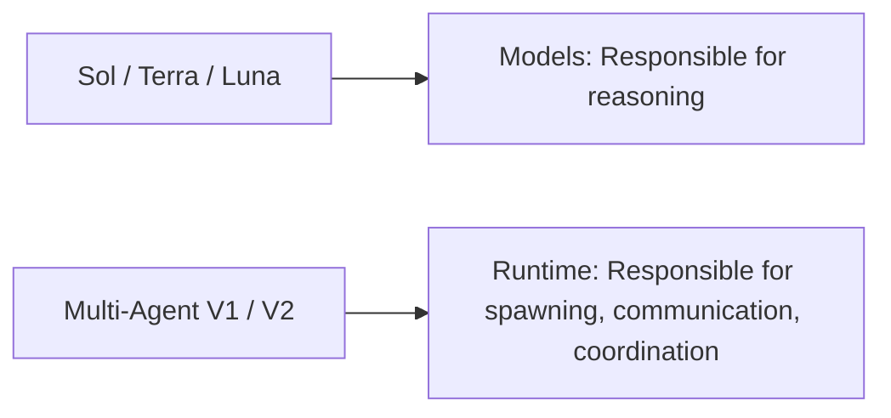
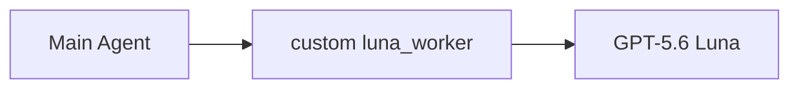
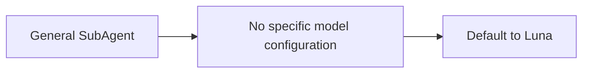
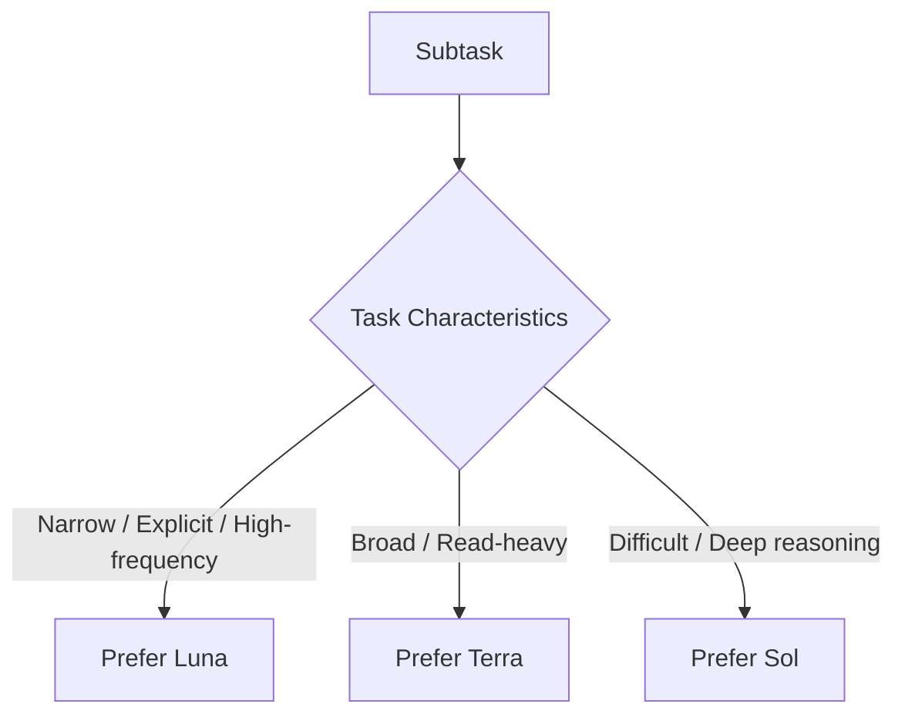
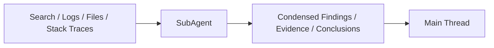

> Last Updated: 2026-08-19
>
> Goals:
>
> - Main agent can currently be **Sol / Terra / Luna**
> - Enable native Codex Multi-Agent capabilities
> - Avoid custom agents like `luna_worker.toml`
> - Do not set `default_subagent_model`
> - Let Codex dynamically route subtasks to Luna / Terra / Sol
> - Use `AGENTS.md` to define delegation and model routing principles

# 1. Background

## What Are Multi-Agent V1 / V2?

`Multi-Agent V1 / V2` refers to Codex's **Multi-Agent runtime / backend**, not Luna model versions.



Previously, Luna was cataloged under V1, while Sol / Terra used V2, which introduced compatibility constraints in some versions:

```text
Sol / Terra V2
→ Spawn Luna
→ Compatibility restrictions
```

Later, Luna was integrated into the current Multi-Agent workflow.

Therefore, this should not be understood as:

```text
Luna V1 → Luna V2
```

More accurately:

> **Luna can now be used as a Codex SubAgent; V1 / V2 describes the Multi-Agent runtime.**

## Why `luna_worker` Is No Longer Needed

Previously:



This essentially hardcoded a specific SubAgent to use Luna.

Now that Codex natively supports SubAgent model selection, unless there is a strict requirement that:

```text
"This Agent must 100% use Luna"
```

There is no longer a need to maintain:

```text
.codex/agents/luna-worker.toml
```

## Why Not Even Set `default_subagent_model`

Codex supports:

```toml
default_subagent_model = "gpt-5.6-luna"
```

However, this is an **optional default value**, not a mandatory configuration.

Setting it is equivalent to:



The desired architecture for this setup is:



Therefore, we deliberately **do not set**:

```toml
default_subagent_model = "..."
default_subagent_reasoning_effort = "..."
```

Rationale:

> **Preserve the flexibility for Codex to dynamically choose models and reasoning effort.**

This is not because `default_subagent_model` is broken, but because this workflow does not require a static, blanket fallback.

# 2. Configuration

All that is needed is:

```text
your-project/
├── AGENTS.md
└── .codex/
    └── config.toml
```

## `.codex/config.toml`

```toml
[agents]

enabled = true

# Recommended starting value: 4-6.
max_concurrent_threads_per_session = 6
```

Do not add extra settings like:

```toml
default_subagent_model = "..."
default_subagent_reasoning_effort = "..."
```

## `AGENTS.md`

```md
## Multi-Agent Orchestration

Use subagents proactively when delegation materially improves speed,
context isolation, or result quality.

Treat the current main model and the subagent model as separate decisions.
Do not assume that a subagent must use the same model as its parent,
or that it must be less capable.

### Delegation

Prefer delegation for independent, parallelizable, read-heavy,
or context-heavy work, including:

- codebase exploration
- repository search
- dependency and call-chain tracing
- documentation research
- tests
- log analysis
- bug triage
- large-file inspection
- bounded technical investigation
- independent review
- summarization of noisy intermediate output

Do not delegate trivial work when coordination overhead exceeds the benefit.

### Model routing

When model selection is available, choose the model according to the
delegated task itself.

Prefer GPT-5.6 Luna for:
- narrow and clearly bounded tasks
- targeted search
- file or symbol location
- straightforward tracing
- simple tests
- documentation lookup
- log summarization
- repetitive or high-volume checks

Prefer GPT-5.6 Terra for:
- broader codebase exploration
- read-heavy multi-file scans
- large-file review
- broader technical investigation
- moderately complex debugging or review

Prefer GPT-5.6 Sol / gpt-5.6 for:
- ambiguous problems
- difficult multi-step reasoning
- architecture
- cross-cutting system behavior
- difficult correctness or concurrency analysis
- high-stakes validation

A Luna or Terra parent may delegate a difficult bounded task to a more
capable model when available.

A Sol or Terra parent should prefer Luna when the task is narrow enough
that higher capability adds little value.

Prefer the smallest model that can reliably complete the task.

### Reasoning effort

Choose reasoning effort according to difficulty.

- low: straightforward latency-sensitive work
- medium: normal baseline
- high: complex tracing, review, edge cases
- xhigh / max: genuinely difficult reasoning

Do not automatically use maximum effort.

### Parallelism

Prefer parallel agents for independent read-heavy work.

Be conservative with overlapping write-heavy work.

Avoid multiple agents simultaneously modifying:
- the same files
- tightly coupled modules
- shared state
- the same API contract
- the same implementation path

Prefer one owner for overlapping writes.

### Main thread

The current main agent remains responsible for:
- understanding the task
- decomposition
- coordination
- integrating results
- resolving conflicts
- final decisions
- final validation

Subagents should return concise, evidence-backed conclusions instead of
large raw dumps.

Keep search output, logs, stack traces, and other noisy intermediate work
outside the main context whenever practical.

The goal is not to maximize agent count.
Use the smallest useful set of agents.
```

# 3. Guiding Principles

The Main agent can be:

```text
Sol
Terra
Luna
```

SubAgents are not required to match the Parent model, nor are they required to be less capable than the Parent.

When supported by the current runtime, the following delegation patterns are conceptually possible:

```text
Sol   → Luna / Terra / Sol
Terra → Luna / Terra / Sol
Luna  → Luna / Terra / Sol
```

Recommended model allocation:

| Model | Best Suited For |
|---|---|
| Luna | Narrow, well-defined, repetitive, high-throughput tasks |
| Terra | Broad, fast, read-heavy workloads |
| Sol | Ambiguous, complex, multi-step, deep-reasoning problems |

For complex tasks, Sol is still recommended as the Main agent because final synthesis and integration require strong judgment; however, this is a quality recommendation rather than a hard constraint.

## Parallelism Principles

```text
Read-heavy
→ Aggressive parallelism

Overlapping Write-heavy
→ Single owner
```

Well-suited for parallelism:

```text
Search
Explore
Research
Tests
Logs
Review
Summarize
```

Not suitable for unconstrained parallelism:

```text
Multiple agents modifying the same file
Multiple agents modifying the same module
Multiple agents modifying shared state
Multiple agents modifying the same API / call chain simultaneously
```

## Context Isolation



Core Principle:

> **SubAgents handle the noise; the Main Thread receives the conclusions.**

# 4. Disabling and Reverting

## Temporary Disable

```toml
[agents]
enabled = false
```

To re-enable:

```toml
[agents]
enabled = true
```

## Disabling Proactive Delegation

Keep:

```toml
[agents]
enabled = true
```

And simply remove the following section from `AGENTS.md`:

```text
## Multi-Agent Orchestration
```

## Full Reversion

Before configuring:

```bash
cp AGENTS.md AGENTS.md.backup
cp .codex/config.toml .codex/config.toml.backup
```

To revert:

```bash
mv AGENTS.md.backup AGENTS.md
mv .codex/config.toml.backup .codex/config.toml
```

If these files did not exist originally, simply delete the newly created files.

When using Git, a dedicated commit is recommended:

```bash
git add AGENTS.md .codex/config.toml
git commit -m "chore: configure Codex multi-agent orchestration"
```

To roll back:

```bash
git revert <commit>
```

# Final Memo

```text
V1 / V2
= Multi-Agent runtime
≠ Luna model version

Main
= Sol / Terra / Luna all supported

Parent Model
≠ Child Model

default_subagent_model
= Optional fallback
≠ Mandatory configuration

Not setting default_subagent_model
= Preserves dynamic model routing capabilities

Luna
= Narrow, well-defined, high-throughput

Terra
= Broad, fast, read-heavy

Sol
= Complex, ambiguous, deep reasoning

Read-heavy
= Aggressive parallelism

Overlapping Write-heavy
= Single owner

Objectives
= Proper task decomposition
+ Dynamic model routing
+ Context isolation
+ Bounded parallelism
+ Reliable synthesis
```
