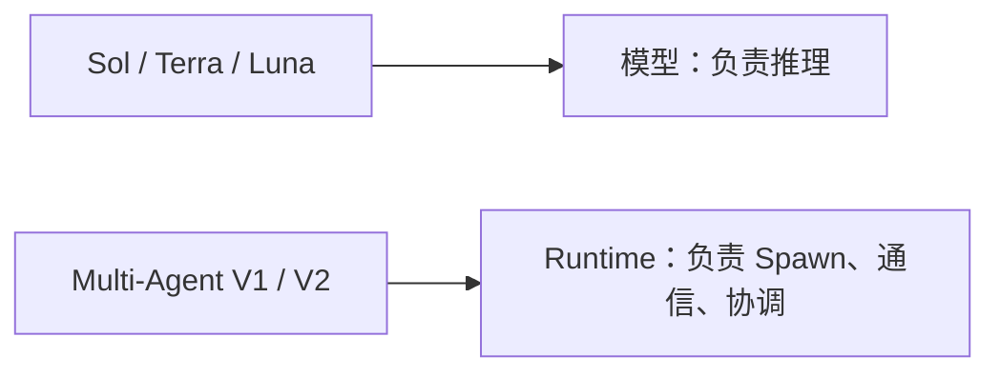
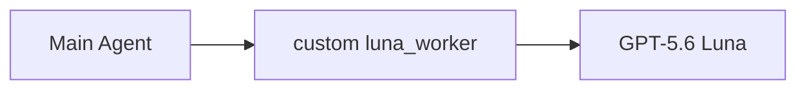
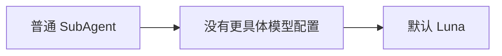
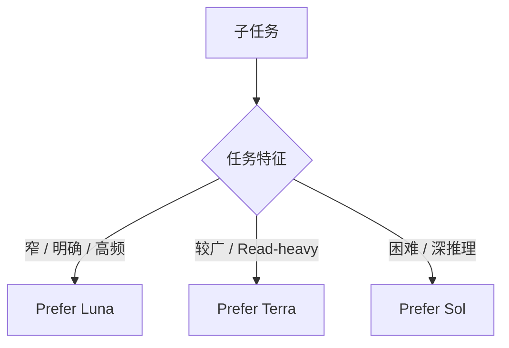
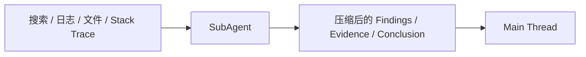

> 更新时间：2026-08-19
>
> 目标：
>
> - 当前 Main 可以是 **Sol / Terra / Luna**
> - 启用 Codex 原生 Multi-Agent
> - 不使用 `luna_worker.toml` 等 Custom Agent
> - 不设置 `default_subagent_model`
> - 由 Codex 根据子任务动态选择 Luna / Terra / Sol
> - 用 `AGENTS.md` 规定 Delegation 和模型路由原则

# 1. 背景

## Multi-Agent V1 / V2 是什么

`Multi-Agent V1 / V2` 指 Codex 的 **Multi-Agent runtime / backend**，不是 Luna 模型版本。



过去 Luna 的 catalog 曾标记为 V1，而 Sol / Terra 使用 V2，因此部分版本存在：

```text
Sol / Terra V2
→ Spawn Luna
→ 兼容性限制
```

后来 Luna 已能进入当前 Multi-Agent 工作流。

因此不要理解成：

```text
Luna V1 → Luna V2
```

更准确的是：

> **Luna 现在已经可以作为 Codex SubAgent 使用；V1 / V2 描述的是 Multi-Agent runtime。**

## 为什么不再需要 `luna_worker`

以前：



本质上只是人为把某个 SubAgent 固定成 Luna。

现在 Codex 已支持原生 SubAgent 模型选择，所以如果不要求：

```text
“这个 Agent 必须 100% 使用 Luna”
```

就没有必要专门维护：

```text
.codex/agents/luna-worker.toml
```

## 为什么连 `default_subagent_model` 也不设置

Codex 支持：

```toml
default_subagent_model = "gpt-5.6-luna"
```

但它是**可选默认值**，不是必填项。

设置后，相当于：



本方案希望的是：



因此有意**不设置**：

```toml
default_subagent_model = "..."
default_subagent_reasoning_effort = "..."
```

原因：

> **保留 Codex 动态选择模型和 reasoning effort 的空间。**

这不因为 `default_subagent_model` 失效，而是因为当前方案不需要统一 fallback。

# 2. 配置

最终只需要：

```text
your-project/
├── AGENTS.md
└── .codex/
    └── config.toml
```

## `.codex/config.toml`

```toml
[agents]

enabled = true

# 建议从 4～6 开始。
max_concurrent_threads_per_session = 6
```

不要额外设置：

```toml
default_subagent_model = "..."
default_subagent_reasoning_effort = "..."
```

## `AGENTS.md`

```md
## Multi-Agent Orchestration

Use subagents proactively when delegation materially improves speed,
context isolation, or result quality.

Treat the current main model and the subagent model as separate decisions.
Do not assume that a subagent must use the same model as its parent,
or that it must be less capable.

### Delegation

Prefer delegation for independent, parallelizable, read-heavy,
or context-heavy work, including:

- codebase exploration
- repository search
- dependency and call-chain tracing
- documentation research
- tests
- log analysis
- bug triage
- large-file inspection
- bounded technical investigation
- independent review
- summarization of noisy intermediate output

Do not delegate trivial work when coordination overhead exceeds the benefit.

### Model routing

When model selection is available, choose the model according to the
delegated task itself.

Prefer GPT-5.6 Luna for:
- narrow and clearly bounded tasks
- targeted search
- file or symbol location
- straightforward tracing
- simple tests
- documentation lookup
- log summarization
- repetitive or high-volume checks

Prefer GPT-5.6 Terra for:
- broader codebase exploration
- read-heavy multi-file scans
- large-file review
- broader technical investigation
- moderately complex debugging or review

Prefer GPT-5.6 Sol / gpt-5.6 for:
- ambiguous problems
- difficult multi-step reasoning
- architecture
- cross-cutting system behavior
- difficult correctness or concurrency analysis
- high-stakes validation

A Luna or Terra parent may delegate a difficult bounded task to a more
capable model when available.

A Sol or Terra parent should prefer Luna when the task is narrow enough
that higher capability adds little value.

Prefer the smallest model that can reliably complete the task.

### Reasoning effort

Choose reasoning effort according to difficulty.

- low: straightforward latency-sensitive work
- medium: normal baseline
- high: complex tracing, review, edge cases
- xhigh / max: genuinely difficult reasoning

Do not automatically use maximum effort.

### Parallelism

Prefer parallel agents for independent read-heavy work.

Be conservative with overlapping write-heavy work.

Avoid multiple agents simultaneously modifying:
- the same files
- tightly coupled modules
- shared state
- the same API contract
- the same implementation path

Prefer one owner for overlapping writes.

### Main thread

The current main agent remains responsible for:
- understanding the task
- decomposition
- coordination
- integrating results
- resolving conflicts
- final decisions
- final validation

Subagents should return concise, evidence-backed conclusions instead of
large raw dumps.

Keep search output, logs, stack traces, and other noisy intermediate work
outside the main context whenever practical.

The goal is not to maximize agent count.
Use the smallest useful set of agents.
```

# 3. 使用原则

Main 可以是：

```text
Sol
Terra
Luna
```

SubAgent 不要求与 Parent 相同，也不要求比 Parent 弱。

在当前 runtime 提供对应模型时，概念上可以出现：

```text
Sol   → Luna / Terra / Sol
Terra → Luna / Terra / Sol
Luna  → Luna / Terra / Sol
```

推荐理解：

| 模型 | 适合 |
|---|---|
| Luna | 窄、明确、重复、高吞吐 |
| Terra | 较广、快速、Read-heavy |
| Sol | 模糊、复杂、多步骤、强推理 |

复杂任务仍然更推荐 Sol 作为 Main，因为最终整合本身也需要较强判断能力；但这只是质量建议，不是硬性限制。

## 并行原则

```text
Read-heavy
→ 积极并行

Overlapping Write-heavy
→ 单一 Owner
```

适合并行：

```text
Search
Explore
Research
Tests
Logs
Review
Summarize
```

不适合随意并行：

```text
多个 Agent 修改同一文件
多个 Agent 修改同一模块
多个 Agent 修改共享状态
多个 Agent 同时改同一 API / 调用链
```

## Context Isolation



原则：

> **SubAgent 处理噪音，Main Thread 接收结论。**

# 4. 关闭与还原

## 临时关闭

```toml
[agents]
enabled = false
```

恢复：

```toml
[agents]
enabled = true
```

## 取消主动 Delegation

保留：

```toml
[agents]
enabled = true
```

删除 `AGENTS.md` 中：

```text
## Multi-Agent Orchestration
```

即可。

## 完全还原

配置前：

```bash
cp AGENTS.md AGENTS.md.backup
cp .codex/config.toml .codex/config.toml.backup
```

恢复：

```bash
mv AGENTS.md.backup AGENTS.md
mv .codex/config.toml.backup .codex/config.toml
```

如果原本没有这些文件，直接删除本次新增文件即可。

如果使用 Git，推荐单独提交：

```bash
git add AGENTS.md .codex/config.toml
git commit -m "chore: configure Codex multi-agent orchestration"
```

需要撤销：

```bash
git revert <commit>
```

# 最终备忘

```text
V1 / V2
= Multi-Agent runtime
≠ Luna 模型版本

Main
= Sol / Terra / Luna 均可

Parent Model
≠ Child Model

default_subagent_model
= 可选 fallback
≠ 必须配置

本方案不设置 default_subagent_model
= 保留动态选模能力

Luna
= 窄、明确、高吞吐

Terra
= 较广、快速、Read-heavy

Sol
= 复杂、模糊、强推理

Read-heavy
= 积极并行

Overlapping Write-heavy
= 单一 Owner

目标
= 正确拆解
+ 动态选模
+ Context Isolation
+ 有限并行
+ 可靠整合
```
